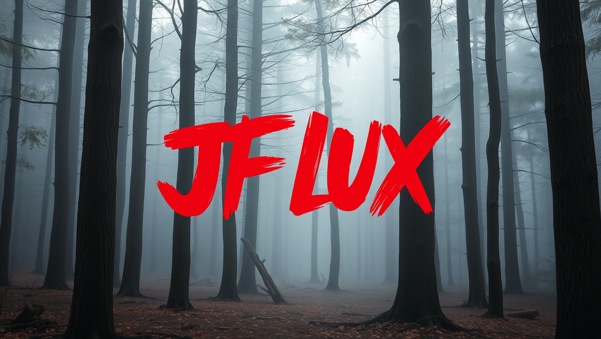
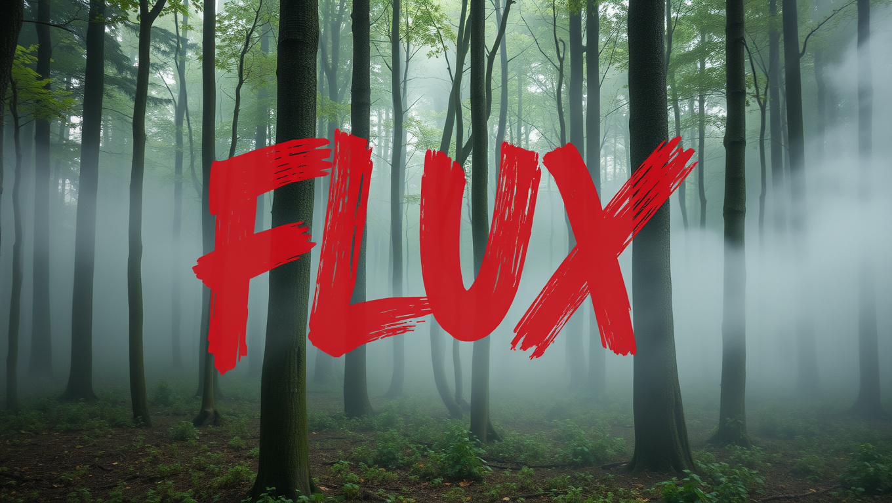
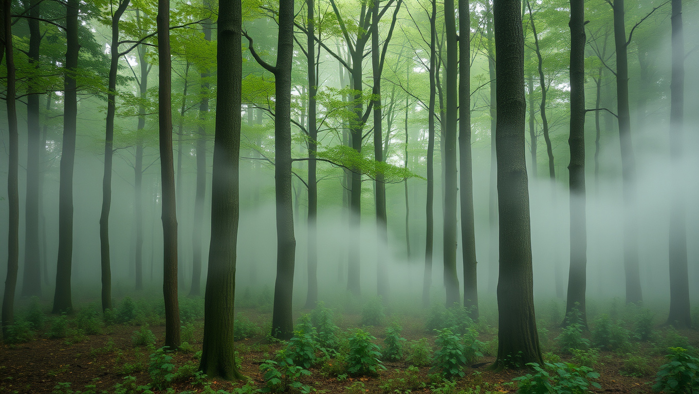
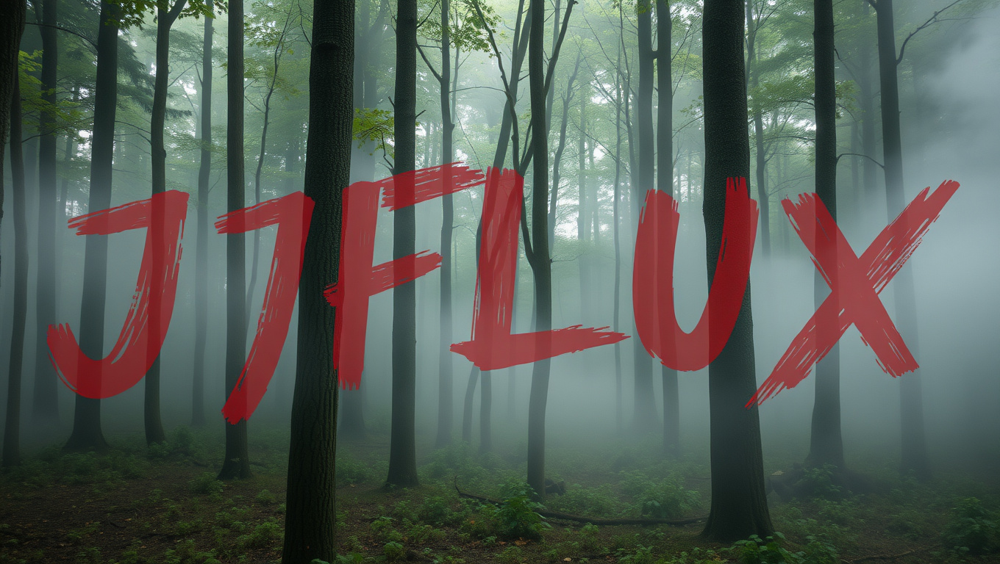

# JFLUX

[](CONTRIBUTING.md)

<div align="center">
</img>
</div>

JAX Implementation [`flax.nnx`](https://flax.readthedocs.io/en/latest/index.html) of Black Forest Labs' FLUX Family of Models. **JFLUX** is a port from the official PyTorch implementation into JAX, using the [`flax.nnx`](https://flax.readthedocs.io/en/latest/index.html) framework.


## Features

- **Full JAX Implementation**: The FLUX.1 family of models, originally built in PyTorch, have been fully re-implemented in JAX.
- **Support for Flux Variants**: Includes support for FLUX.1 variants namely [schnell](https://huggingface.co/black-forest-labs/FLUX.1-schnell) and [dev](https://huggingface.co/black-forest-labs/FLUX.1-dev). (tested on schnell on an A100)
- **Open-Source and Community-Driven**: We encourage contributions and collaboration to further improve the performance and capabilities of this repository. (Refer to the Roadmap Section for more details)

## Installation

To get started, follow these simple steps:

1. Clone the repository:
   ```bash
   git clone https://github.com/ml-gde/jflux.git
   cd jflux
   ```
2. With python version `>=3.10`, run the model with a prompt (install [`uv`](https://docs.astral.sh/uv/getting-started/installation/) beforehand):
   ```bash
   uv run jflux
   ```

> [!NOTE]
> This might help 😃
> ```
> uv python install 3.10
> uv python pin 3.10
> ```
>
> If you don't have `uv` you can run the following command to get running. 

For GPU:

> ```
> cd jflux && pip install -U pip && pip install -e .[gpu]
> ```

For TPU:

> ```
> cd jflux && pip install -U pip && pip install -e .[tpu]
> ```


## Usage

Once installed, JFLUX can be used to generate high-quality images from text prompts via a cli. For example:

```bash
uv run jflux --prompt "A cute dog"
```

Additional options are available to adjust resolution, sampling steps, and more.

<details>
<summary>CLI Overview</summary>
   
   ```sh
   NAME
    jflux - Sample the flux model. Either interactively (set `--loop`) or run for a single image.

   SYNOPSIS
       jflux <flags>
   
   DESCRIPTION
       Sample the flux model. Either interactively (set `--loop`) or run for a single image.
   
   FLAGS
    --name=NAME
        Type: str
        Default: 'flux-schnell'
        Name of the model to load
    -w, --width=WIDTH
        Type: int
        Default: 1360
        width of the sample in pixels (should be a multiple of 16)
    -h, --height=HEIGHT
        Type: int
        Default: 768
        height of the sample in pixels (should be a multiple of 16)
    -s, --seed=SEED
        Type: Optional[int | None]
        Default: None
        Set a seed for sampling
    -p, --prompt=PROMPT
        Type: str
        Default: 'a photo of a forest with mist swirling around the tree trun...'
        Prompt used for sampling
    --num_steps=NUM_STEPS
        Type: Optional[int | None]
        Default: None
        number of sampling steps (default 4 for schnell, 50 for guidance distilled)
    -l, --loop=LOOP
        Type: bool
        Default: False
        start an interactive session and sample multiple times
    -g, --guidance=GUIDANCE
        Type: float
        Default: 3.5
        guidance value used for guidance distillation
    --offload=OFFLOAD
        Type: bool
        Default: True
    --output_dir=OUTPUT_DIR
        Type: str
        Default: 'output'
    -a, --add_sampling_metadata=ADD_SAMPLING_METADATA
        Type: bool
        Default: True
        Add the prompt to the image Exif metadata
   ```

</details>


## Some Results

| Image | Prompt | PRNG |
| :--: | :--: | :--: |
|  | a photo of a forest with mist swirling around the tree trunks. The word "FLUX" is painted over it in big, red brush strokes with visible texture | 42 |
|  | a cute dog | 42|
|  | a photo of a forest with mist swirling around the tree trunks. | 42 |
|  | a photo of a forest with mist swirling around the tree trunks. The word "JFLUX" is painted over it in big, red brush strokes with visible texture | 42 |
|  | a photo of a forest with mist swirling around the tree trunks. The word "JFLUX" is painted over it in big, red brush strokes with visible texture | 102333 |

## Hiccups and Known Issues

There are a few challenges we’re actively working to resolve. We encourage contributions from the community to help improve the project:

- **No TPU Support**: As of now, the code does not support TPUs.
- **High VRAM Requirements**: Running `flux-schnell` currently requires **40 GB of VRAM** (A100 or higher).
- **Image Generation Time**: Image generation takes longer than expected, especially for high-resolution outputs (takes ~51s on an A100).
- **bfloat16 Upcasting**: Weights are upcasted from bfloat16 to fp32 because **NumPy** does not handle bf16 natively, leading to some inefficiencies.
- **porting weights**: Currently, we load pytorch weights and convert them to JAX tensors during inference; however, it would be ideal if, after the first run, we serialise the next weights to avoid redundant conversions in each run.
- **pure JAX inference**: As of now, we load the `t5` and `clip` models as torch `Module` and wrap their outputs as JAX arrays. This prevents OOM while inference; having a pure JAX inference pipeline would be ideal.

## Roadmap

- [x] Add TPU support (https://github.com/ml-gde/jflux/issues/19) (fixed in https://github.com/ml-gde/jflux/pull/25)
- [ ] Optimize VRAM usage with gradient checkpointing (https://github.com/ml-gde/jflux/issues/20)
- [ ] Explore further optimizations for image generation time
- [ ] Improve the handling of bfloat16 tensors with JAX
- [ ] Serialise `nnx` weights during cli run (https://github.com/ml-gde/jflux/issues/22)
- [ ] Port `t5` and `clip` models to `nnx.Module` (https://github.com/ml-gde/jflux/issues/21)

## Acknowledgements

We’d like to extend our gratitude to those who have supported and guided this project:

- Christian Garcia (https://github.com/google/flax/discussions/4273#discussioncomment-10892910)
- Jake VanderPlas (https://github.com/jax-ml/ml_dtypes/issues/81#issuecomment-2399636232)
- Sayak Paul for major brainstorming sessions
- Aakash Kumar Nain for helping us with JAX issues
- Thanks to the ML Developer Programs' team at Google for providing GCP credits.

Special thanks to **Black Forest Labs** for the original FLUX implementation.

## License

This project is licensed under the same license as the [black-forest-labs/flux](https://github.com/black-forest-labs/flux) repository

## References

- **Original Implementation**: [black-forest-labs/flux](https://github.com/black-forest-labs/flux)
